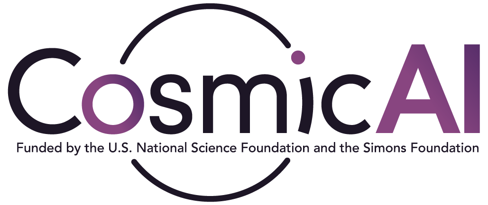

# RELISH

This repository will host the source code for RELISH: LLM REgression with a
Latent Iterative State Head, published as a conference paper at COLM 2026.

Paper: [RELISH: LLM REgression with a Latent Iterative State Head](https://arxiv.org/pdf/2604.01206)

Source code is forthcoming.

<p align="center">
  <a href="https://www.cosmicai.org/">
    
  </a>
</p>

## Acknowledgments

We appreciate the valuable feedback we received on this manuscript from our
anonymous reviewers, Junyi Jessy Li, Leqi Liu, and members of the Artificial
Intelligence and Human-Centered Computing (AI&HCC) lab at UT Austin. This work
was supported by the NSF under Cooperative Agreement 2421782 and the Simons
Foundation grant MPS-AI-00010515, awarded to the
[NSF-Simons AI Institute for Cosmic Origins (CosmicAI)](https://www.cosmicai.org/).
This research was also supported by computational resources provided by the Texas
Advanced Computing Center (TACC) at The University of Texas at Austin. The
statements made herein are solely the opinions of the authors and do not reflect
the views of the sponsoring agencies.

## Citation

```bibtex
@inproceedings{su2026relish,
  title = {RELISH: LLM REgression with a Latent Iterative State Head},
  author = {Su, Yiheng and Lease, Matthew},
  booktitle = {Proceedings of the Third Conference on Language Modeling},
  year = {2026},
  url = {https://arxiv.org/abs/2604.01206}
}
```
